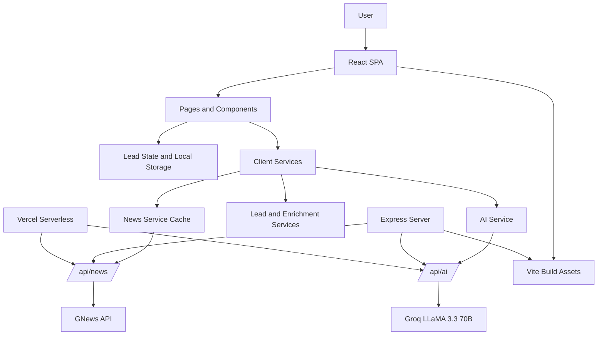

# LegacyCompass

**AI-powered B2B lead intelligence platform**: discover, enrich, score, and convert leads with real-time market insights across 110+ countries and 50+ industries.


## Overview

LegacyCompass is a React and TypeScript lead intelligence app for sales teams that need lead discovery, enrichment, scoring, market analysis, and AI-assisted outreach in one workflow. The frontend runs on Vite, while AI and news requests are routed through server-side proxies so API keys do not need to be exposed in the browser.

## Features

| Feature | Description |
| --- | --- |
| Smart Scraping | AI-assisted lead discovery with deduplication and local persistence |
| Data Enrichment | Fill missing email, phone, LinkedIn, revenue, employee count, and descriptions |
| AI Lead Scoring | Multi-factor score calculation using company attributes and data completeness |
| Market AI | Industry and country-level market analysis with trends, risks, and opportunities |
| AI Email Generator | Personalized outreach emails with tone and purpose controls |
| Real-Time News | Location-aware industry news via GNews through a server proxy |
| Analytics Dashboard | KPIs, status tracking, score distribution, and top industries |
| Performance Paths | Virtualized lead table, memoized dashboard calculations, and cached news queries |

## Architecture



## Tech Stack

| Layer | Technology |
| --- | --- |
| Frontend | React 18, TypeScript, Vite 5 |
| Styling | Tailwind CSS |
| Icons | Heroicons, Lucide React |
| AI Proxy | Express or Vercel Serverless |
| AI Provider | Groq API |
| News Provider | GNews API |
| Persistence | Browser localStorage |
| Quality | TypeScript, ESLint, npm audit |

## Quick Start

```bash
git clone https://github.com/BugHunterX2101/LegacyCompass.git
cd LegacyCompass
npm install
cp .env.example .env
```

Add your keys to `.env`:

```env
GROQ_API_KEY=your-groq-api-key-here
GNEWS_API_KEY=your-gnews-api-key-here
VITE_USE_REAL_AI=true
```

Run locally:

```bash
npm run dev
npm run dev:server
```

The Vite dev server runs on `http://localhost:5173`. The Express API/server runs on `http://localhost:3000`.

## Scripts

| Command | Purpose |
| --- | --- |
| `npm run dev` | Start the Vite development server |
| `npm run dev:server` | Start the Express API/static server |
| `npm run typecheck` | Run TypeScript checks |
| `npm run lint` | Run ESLint |
| `npm test` | Run the project verification check |
| `npm run build` | Type-check and build production assets |
| `npm run serve` | Serve the built app with Express |
| `npm run preview` | Preview the Vite build |

## File Structure

```text
LegacyCompass/
├── api/
│   ├── ai.ts                         # Vercel AI proxy
│   └── news.ts                       # Vercel GNews proxy
├── src/
│   ├── components/
│   │   ├── ai/                       # AI insights, email, market, conversation views
│   │   ├── common/                   # Shared UI and error handling
│   │   ├── dashboard/                # Analytics cards, charts, news feed
│   │   ├── enrichment/               # Lead enrichment workflow
│   │   ├── homepage/                 # Home experience
│   │   ├── import/                   # Lead import modal
│   │   ├── layout/                   # Top-level layout controls
│   │   ├── leads/                    # Lead table views
│   │   ├── performance/              # Virtualized table and monitor
│   │   ├── scraping/                 # Lead scraping modal
│   │   └── search/                   # Advanced search controls
│   ├── data/                         # Suggestion and company datasets
│   ├── services/                     # AI, news, lead, analytics, performance services
│   ├── types/                        # Shared TypeScript interfaces
│   ├── utils/                        # Validation and performance utilities
│   ├── App.tsx                       # Main application shell
│   ├── index.css                     # Tailwind and global styles
│   └── main.tsx                      # React entry point
├── .env.example                      # Environment variable template
├── eslint.config.js                  # ESLint flat config
├── package.json                      # Scripts and dependencies
├── server.js                         # Express server and API proxy
├── tailwind.config.js                # Tailwind theme
├── tsconfig*.json                    # TypeScript configs
├── vercel.json                       # Vercel routing/deployment config
└── vite.config.ts                    # Vite config and build optimization
```

## Environment Variables

| Variable | Required | Purpose |
| --- | --- | --- |
| `GROQ_API_KEY` | Yes | Groq API key used by `/api/ai` (uses `llama-3.3-70b-versatile` for real-time analysis, enrichment, emails, and market insights) |
| `GNEWS_API_KEY` | Yes | GNews API key used by `/api/news` for real-time location-aware industry news |
| `VITE_USE_REAL_AI` | Optional | Set to `true` to enforce strict real-time AI workflows (defaults to `true`) |
| `VITE_API_URL` | Optional | API base URL override for deployments |
| `VITE_ENABLE_PERFORMANCE_MONITORING` | Optional | Enables performance monitoring UI in development |

> [!IMPORTANT]
> The application operates in **Strict Real-Time Mode**. All mock and seed data fallbacks have been removed for AI features. If API keys are missing or invalid, the app will explicitly surface configuration/connection errors rather than displaying simulated results.

## Deployment

### Vercel Deployment

1. **Connect & Link**:
   Push your repository to GitHub, link it using the Vercel CLI:
   ```bash
   npx vercel link --yes
   ```

2. **Configure Environment Variables**:
   Add your API keys to the project across all environments (Production, Preview, and Development):
   ```bash
   npx vercel env add GROQ_API_KEY --value "your-groq-key-here" --yes --force
   npx vercel env add GNEWS_API_KEY --value "your-gnews-key-here" --yes --force
   ```

3. **Deploy to Production**:
   Deploy and activate the environment variables:
   ```bash
   npx vercel --prod --yes
   ```

### Self-Hosted

```bash
npm run build
npm run serve
```

Express serves the built SPA from `dist/` and exposes `/api/ai` and `/api/news` on the same origin.

## Verification

Before deploying, run validation checks to ensure zero TypeScript or build issues:

```bash
npm run lint
npm run typecheck
npm run build
```

## License

MIT

